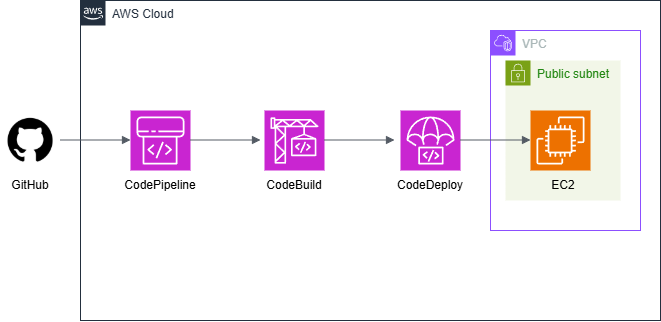
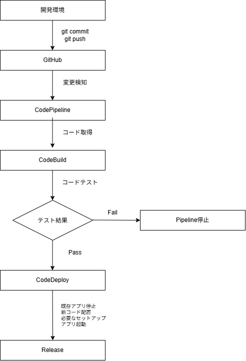

# CI/CDパイプライン

GitHubへのアプリケーションコードの変更を起点として、
自動テストからAmazon EC2へのデプロイまでを行うCI/CDパイプラインです。  
AWS CodePipelineを中心に、CodeBuildによる自動テストと
CodeDeployによるアプリケーション配布を連携し、
**テストに成功したコードのみをEC2へデプロイする仕組み**を構築しています。  
AWSコンソールで各サービスの役割や連携方法を確認した後、
AWSリソースをTerraformでコード化し、
EC2の初期構築についてはAnsibleで自動化しています。

---

## 本プロジェクトの位置づけ

本プロジェクトは、AWSにおけるCI/CDの仕組みについて、
**ソースコードの変更からテスト・デプロイまでの流れと、
各AWSサービスの役割・連携方法を理解すること**
を主な目的とした学習・検証用の構成です。

単にCI/CDサービスを構築するだけではなく、

- TerraformによるAWS基盤の構築
- AnsibleによるEC2初期構築
- CodeBuildによる自動テスト
- CodeDeployによるアプリケーション更新
- CodePipelineによる一連の処理の制御

までを一連の仕組みとして構築しています。

---

## アーキテクチャ



GitHubで管理しているFastAPIアプリケーションをCodePipelineから取得し、
CodeBuildでテストを実行します。  
テスト成功後、CodeDeployを利用してEC2へアプリケーションを配布します。  

---

## 処理フロー



CodeBuildによるテスト結果をデプロイ可否の判定条件とし、
テストに失敗した場合はPipelineを停止します。  
テスト成功時のみCodeDeployへ処理を進め、
EC2上のアプリケーションを更新します。  

---

## 仕様

- GitHubでアプリケーションコードを管理
- CodePipelineでSource / Build / Deployを制御
- CodeBuildでpytestによる自動テストを実行
- テスト失敗時はデプロイを実行せずPipelineを停止
- テスト成功時のみCodeDeployによるEC2への配布を実行
- CodeDeployのLifecycle Hookからアプリケーションの再起動・動作確認を実行
- デプロイ失敗時はAuto Rollbackを実行
- CI/CD基盤はTerraformで構築
- EC2初期構築はAnsibleで自動化

---

## 主な構成

| サービス・技術 | 用途 |
|---|---|
| GitHub | アプリケーションコードの管理 |
| AWS CodePipeline | CI/CD全体の制御 |
| AWS CodeBuild | pytestによる自動テスト |
| AWS CodeDeploy | EC2へのアプリケーション配布 |
| AWS CodeConnections | GitHubとAWSの接続 |
| Amazon S3 | Pipeline Artifactの保存 |
| Amazon EC2 | FastAPIアプリケーションの実行 |
| AWS IAM | 各AWSサービスの実行権限の制御 |
| Amazon CloudWatch Logs | CodeBuild等の実行ログ確認 |
| Python / FastAPI | デプロイ対象アプリケーション |
| pytest | アプリケーションテスト |
| Ansible | EC2初期構築の自動化 |
| Terraform | AWSリソースのIaC化 |

---

## ディレクトリ構成

```text
ci-cd/
├── app/
│   ├── main.py
│   ├── requirements.txt
│   └── tests/
├── ansible/
├── docs/
│   ├── ci_cd_diagram.png
│   └── ci_cd_flow.png
├── scripts/
│   ├── restart.sh
│   └── validate.sh
├── terraform/
│   ├── code_iam.tf
│   ├── codebuild.tf
│   ├── codedeploy.tf
│   └── codepipeline.tf
├── appspec.yml
├── buildspec.yml
└── README.md
```

---

## Terraform

AWSコンソールで各サービスの役割・設定内容を確認した後、
CI/CD基盤をTerraformでコード化しています。  
主なTerraform管理対象は以下です。

- EC2 / Security Group
- IAM Role / IAM Policy
- CodeConnections
- CodeBuild
- CodeDeploy
- CodePipeline
- Pipeline Artifact用S3バケット

以下の一連の操作による構築・削除を確認しています。

```bash
terraform init
terraform fmt
terraform validate
terraform plan
terraform apply
terraform destroy
```

TerraformによってAWSリソース間の依存関係をコードとして管理し、
検証環境を繰り返し構築・削除できる構成としています。

---

## Ansible

TerraformによるEC2作成後、
アプリケーションを実行するための初期環境をAnsibleで構築します。  
主な構築内容は以下です。

- Python実行環境
- Python仮想環境
- FastAPI / Uvicorn
- systemdサービス
- CodeDeploy Agent
- 初回アプリケーション配置

TerraformをAWSインフラの構築、
AnsibleをEC2内部の構成管理として役割分担しています。

---

## CodeBuild

`buildspec.yml` にビルド・テスト処理を定義しています。  
CodeBuildでは依存ライブラリをインストールした後、
pytestによるテストを実行します。

```bash
python -m pytest tests/
```

テストが失敗した場合はBuildステージを失敗として終了し、
後続のCodeDeployは実行しません。

---

## CodeDeploy

`appspec.yml` にEC2への配置内容とLifecycle Hookを定義しています。  
主な処理は以下です。

```text
既存アプリケーション停止
        ↓
新しいコードを配置
        ↓
依存ライブラリ更新
        ↓
アプリケーション起動
        ↓
動作確認
```

デプロイ失敗時にはAuto Rollbackを実行する構成としています。

---

## 動作確認

### 自動テスト

CodeBuildでpytestを実行し、テストが正常終了することを確認しています。

```text
2 passed
```

### デプロイ

CodePipelineを手動実行し、以下のすべてのステージが正常終了することを確認しています。

```text
Source → Build → Deploy
  OK      OK       OK
```

デプロイ後、EC2上のFastAPIへアクセスし、
アプリケーションが更新されていることを確認しています。

```bash
curl http://<EC2_PUBLIC_IP>:8000/version
```

```json
{"version":"1.2"}
```

---

## 手動作業

CodeConnectionsリソース自体はTerraformで作成していますが、
GitHubとの初回接続時にはGitHub側での認証が必要です。  
認証完了後、Connection Statusが `AVAILABLE` となることを確認します。
