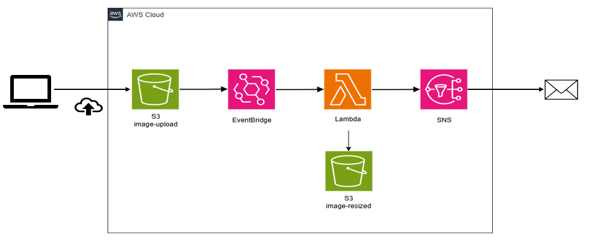
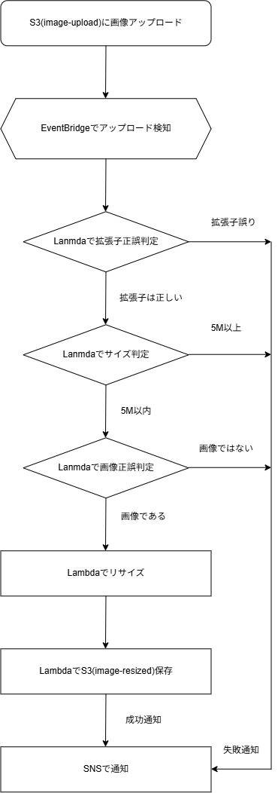

# イベント駆動アーキテクチャ

Amazon S3への画像アップロードを契機として、
画像の検証・リサイズ・保存・通知を自動実行するイベント駆動アーキテクチャです。  
AWSコンソールで設計・構築・動作確認した環境をTerraformでコード化し、
Terraformによる再構築後も正常系・異常系を含めた動作確認を実施しています。

---

## 本プロジェクトの位置づけ

本プロジェクトは、AWSのイベント駆動アーキテクチャにおける
各サービスの役割やサービス間連携、TerraformによるIaC化の理解を主な目的とした学習・検証用の構成です。  
そのため、Lambdaのアプリケーション実装については、
本アーキテクチャの動作確認に必要な範囲で実装しています。

---

## アーキテクチャ



S3への画像アップロードをEventBridgeで検知し、Lambdaを起動します。
Lambdaで画像を検証・リサイズした後、リサイズ済み画像をS3へ保存し、
処理結果をSNSで通知します。

---

## 処理フロー



Lambdaではファイルサイズ・拡張子・画像ファイルとしての妥当性を確認し、
正常な画像のみリサイズ処理を実行します。

---

## 仕様

- S3への画像アップロードを契機に処理を開始
- EventBridgeでS3の `Object Created` イベントを検知
- 対応画像形式は JPEG / PNG
- ファイルサイズ上限は 5MB
- 正常な画像はLambdaでリサイズし、リサイズ用S3バケットへ保存
- 正常終了時はSNS Success Topicへ通知
- 異常終了時はSNS Failure Topicへ通知
- S3上のファイルはLifecycleにより7日後に削除

---

## 主な構成

| サービス・技術 | 用途 |
| --- | --- |
| Amazon S3 | アップロード画像・リサイズ画像の保存 |
| Amazon EventBridge | S3イベントの検知・Lambdaの起動 |
| AWS Lambda | 画像の検証・リサイズ処理 |
| Amazon SNS | 正常終了・異常終了のメール通知 |
| AWS IAM | Lambda実行ロール・アクセス権限の制御 |
| Amazon CloudWatch Logs | Lambda実行ログの確認 |
| Python | Lambda処理の実装 |
| boto3 | S3・SNSの操作 |
| Pillow | 画像の検証・リサイズ |
| Terraform | AWSリソースのIaC化 |

---

## ディレクトリ構成

```text
event-driven/
├── app/
│   └── lambda/
│       └── handler.py
├── docs/
│   ├── event_driven_diagram.png
│   └── event-driven_processing_flow.drawio.png
├── pillow-layer/
│   └── pillow-layer.zip        # Git管理対象外
├── terraform/
│   ├── event_bridge.tf
│   ├── iam.tf
│   ├── lambda.tf
│   ├── providers.tf
│   ├── s3.tf
│   ├── sns.tf
│   ├── variables.tf
│   ├── versions.tf
│   └── terraform.tfvars        # Git管理対象外
└── README.md
```

---

## Terraform

AWSコンソールで構築・動作確認した構成をTerraformでコード化しています。  
主なTerraform管理対象は以下です。

- S3バケット / Lifecycle / EventBridge通知設定
- SNS Topic / Subscription
- Lambda実行ロール / IAM Policy
- Lambda Function
- Lambda Layer
- EventBridge Rule / Target
- EventBridgeからLambdaを実行するためのPermission

以下の一連の操作による構築・削除を確認しています。

```bash
terraform init
terraform fmt
terraform validate
terraform plan
terraform apply
terraform destroy
```

Terraformによる再構築後にも、正常系・異常系の動作確認を実施しています。

---

## Lambda Layer

画像処理ライブラリとしてPillowを使用しています。  
PillowはLambda LayerとしてLambda本体から分離しています。

`pillow-layer.zip` はGit管理対象外としているため、
Terraformを実行する前に以下の場所へLayer用ZIPファイルを配置する必要があります。

```text
event-driven/pillow-layer/pillow-layer.zip
```

Lambda LayerはPython 3.12 / x86_64環境を対象としています。

---

## 環境変数

Lambdaから利用するリソース情報はハードコードせず、
環境変数として設定しています。

| 環境変数 | 用途 |
| --- | --- |
| `RESIZED_BUCKET_NAME` | リサイズ画像保存先S3バケット |
| `SUCCESS_TOPIC_ARN` | 正常終了通知用SNS Topic |
| `FAILURE_TOPIC_ARN` | 異常終了通知用SNS Topic |

Terraformから各AWSリソースの値を参照して設定します。

---

## 動作確認

### 正常系

JPEG / PNG画像をアップロードし、以下を確認しています。

- EventBridgeによるイベント検知
- Lambdaの起動
- 画像のリサイズ
- リサイズ済み画像のS3保存
- SNS Success Topicからのメール通知

### 異常系

入力チェックで処理対象外となるファイルをアップロードし、
リサイズ処理を実行せずSNS Failure Topicから通知されることを確認しています。

主な確認内容：

- ファイルサイズ上限超過
- 対応していないファイル形式

---

## 補足

S3バケットは学習・検証環境として繰り返し構築・削除することを想定し、
Terraformの `force_destroy` を有効にしています。  
これにより、テストデータやnull versionなどのオブジェクトが残っている場合でも、
`terraform destroy` によって環境を削除できる構成としています。