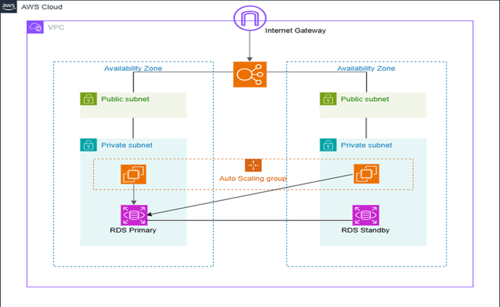

# Pattern 1 - 高可用Webアーキテクチャ

## 概要

本プロジェクトでは、AWS上に高可用なWebアーキテクチャを構築し、AWSコンソールで設計・構築・動作確認した構成をTerraformでコード化しています。  
Terraformの文法を学ぶだけでなく、AWSサービスの役割や設計意図を理解し、Infrastructure as Code（IaC）として再現することを目的としています。  

---

# システム構成



---

# 使用サービス

- Amazon VPC
- Public Subnet
- Private Subnet
- Internet Gateway
- Route Table
- Security Group
- Application Load Balancer
- Target Group
- Launch Template
- Auto Scaling Group
- Amazon EC2
- Amazon RDS
- Terraform

---

# ディレクトリ構成

```text
high-availability/
├── README.md
├── docs/
│   └── high-availability.png
└── terraform/
    ├── providers.tf
    ├── versions.tf
    ├── vpc.tf
    ├── subnet.tf
    ├── igw.tf
    ├── route_table.tf
    ├── security_group.tf
    ├── target_group.tf
    ├── iam.tf
    ├── launch_template.tf
    ├── load_balancer.tf
    ├── auto_scaling_group.tf
    ├── rds.tf
    ├── variables.tf
    └── terraform.tfvars.example
```

---

# Terraform構成

AWSリソースごとにTerraformファイルを分割し、AWSコンソールで構築した構成との対応が分かるよう管理しています。

| Terraform | AWSリソース |
|-----------|------------|
| `vpc.tf` | Amazon VPC |
| `subnet.tf` | Public / Private Subnet |
| `igw.tf` | Internet Gateway |
| `route_table.tf` | Route Table |
| `security_group.tf` | Security Group |
| `target_group.tf` | Target Group |
| `iam.tf` | IAM Role / Instance Profile |
| `launch_template.tf` | Launch Template |
| `load_balancer.tf` | Application Load Balancer |
| `auto_scaling_group.tf` | Auto Scaling Group |
| `rds.tf` | Amazon RDS |

---

# 動作確認

以下の内容について動作確認を実施しています。

- `terraform fmt`
- `terraform validate`
- `terraform plan`
- `terraform apply`
- `terraform destroy`

---

# 検証結果

- TerraformからAWSリソースを正常に作成できることを確認
- TerraformからAWSリソースを正常に削除できることを確認
- Application Load Balancer経由でAuto Scaling Groupへトラフィックを分散する構成を確認
- EC2はPrivate Subnetへ配置
- NAT Gatewayを作成していないため、UserData内の `dnf install nginx` は失敗
- 上記はPrivate Subnetからインターネットへ接続できない設計による想定どおりの動作であることを確認

---

# 設計方針

本プロジェクトでは、以下の方針でTerraformを実装しています。

- AWSコンソールで構築した内容をTerraformで再現する
- コードを設計書として読めることを重視する
- 重要なデフォルト値は明示する
- 利用しないオプションは記述しない
- AWSリソース単位でTerraformファイルを分割する
- 可読性と保守性を重視した構成とする

---

# 学んだこと

本プロジェクトを通じて、以下の内容を理解・習得しました。

- AWSコンソールとTerraformの対応関係
- AWSリソース間の依存関係
- Terraform Registryを利用した実装方法
- `plan`・`apply`・`destroy` を用いたIaC運用
- コードによるインフラ構成管理の考え方

---

# 今後の改善予定

- NAT Gatewayを追加した構成
- Terraform Module化
- `locals` の活用
- `for_each` を利用したリファクタリング
- CI/CDによるTerraform実行の自動化